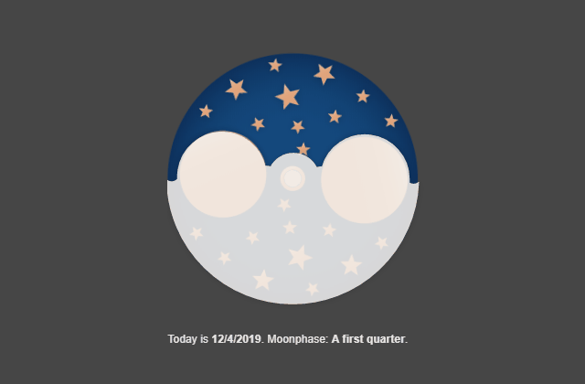

# Moonphase Tool

## Concept

You have a watch that has a moonphase but don't know how to set it up? Do not wait for the next full moon.

The moonphase tool shows current moonphase so that you can easily set your watch.

## Usage

Go to https://chen.works/web-art/moonphase/

## Acknowledgements

The design of the moonphase you see in the tool is from the watch brand **[frederique constant](https://frederiqueconstant.com/collections/manufacture/slimline-moonphase/)**. But the tool should suffice for all moonphase watches.
